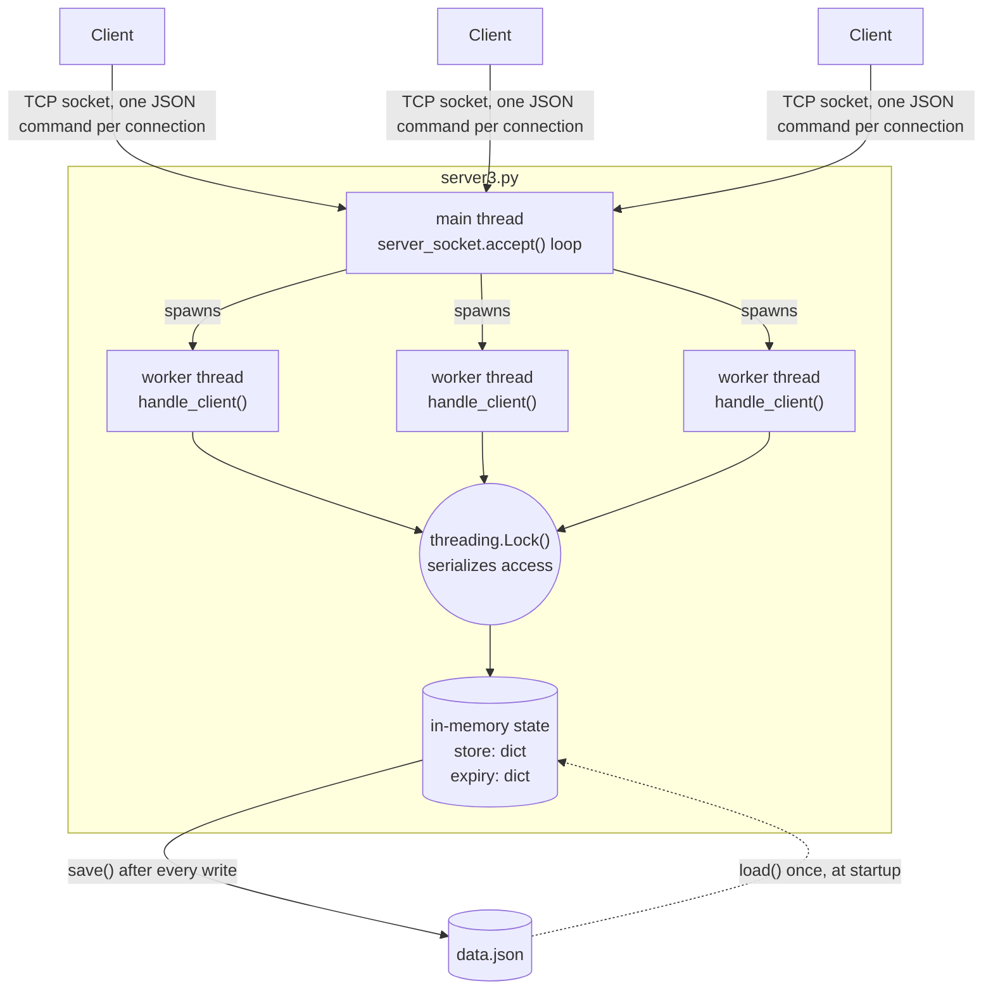

# simple-redis-in-py

A minimal, from-scratch clone of Redis's core idea: an in-memory key-value store, reachable over TCP by multiple clients at once, with expiring keys and disk persistence.

## Architecture



Each client connection gets its own thread, so N clients can be "talking" to the server at the same time. Every thread, however, has to go through the same `threading.Lock()` before it touches `store`/`expiry`, so command execution itself stays serialized — one command's read-modify-write finishes before the next one starts, which is what keeps concurrent `SET`/`GET`/`DELETE`s from corrupting each other. Reads that don't touch a TTL (bare `GET`) still take the lock, trading a little throughput for a much simpler correctness argument. After any mutating command, the whole `store` + `expiry` state is rewritten to `data.json`, and that file is read back into memory once when the server starts — that's the entire persistence story.

## Requirements

- Python 3.x
- Modules: `socket` and `json` (both are part of Python’s standard library)

## How to Run

1. **Start the Server**:
   - Open a terminal and run the server:

     ```bash
     python server3.py
     ```

2. **Run the Client**:
   - Open another terminal and run the client to send commands to the server:

     ```bash
     python client3.py
     ```

## Storage

The server stores key-value pairs in memory using a Python dictionary. Commands like `SET`, `GET`, `DELETE`/`DEL`, `EXISTS`, `EXPIRE`, and `MSET` allow you to manipulate and retrieve stored data.

Data is also persisted to a `data.json` file on every write, and reloaded from that file on startup, so it survives server restarts.

## Concurrency

Each client connection is handled on its own thread, so multiple clients can connect and issue commands at the same time. A lock guards access to the in-memory store so concurrent reads/writes stay consistent.

## Key Expiry

Use `EXPIRE key ttl_seconds` to set a key to expire after a number of seconds. Expired keys are lazily removed the next time they're accessed (via `GET`, `EXISTS`, `DELETE`, etc.).

## Communication

The client and server communicate via a TCP connection using JSON-formatted strings. The client sends commands to the server in JSON format, and the server responds in JSON as well. This makes the protocol easy to understand and extend for various actions like `SET`, `GET`, `DELETE`/`DEL`, `EXISTS`, `EXPIRE`, `FLUSH`, `MSET`, and `MGET`.
